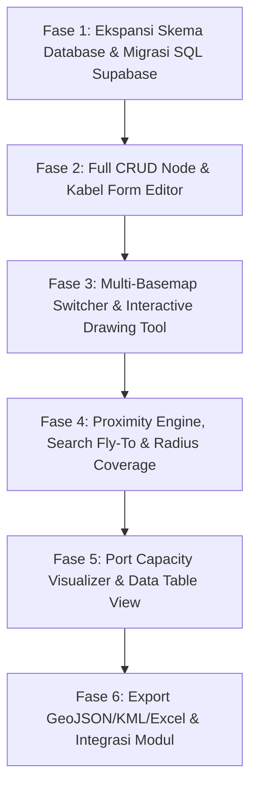

# MASTERPLAN PENGEMBANGAN FITUR LENGKAP GIS MAPPING FTTH (FV-2)
## Synerix Network Operations Platform — Advanced GIS Suite & Full CRUD
*Dokumen Arsitektur, Matriks Fitur & Roadmap Pengerjaan Bertahap*  
*Versi: 2.0 (Comprehensive FTTH GIS System)*  
*Tanggal: Oktober 2026*  
*Status: Ready for Implementation*

---

## 1. PENDAHULUAN & VISI PENGEMBANGAN

Pondasi GIS Mapping pada modul `/mapping` saat ini telah berhasil mengimplementasikan *client-side ingestion* (KML/KMZ via JSZip dan @tmcw/togeojson), *dynamic marker clustering*, *canvas rendering kabel*, dan *layer manager dasar*.

Namun, untuk kebutuhan operasional teknis jaringan fiber optik lapangan berstandar *enterprise*, modul peta tidak boleh hanya berfungsi sebagai **"Viewer Pasif"**, melainkan harus bertransformasi menjadi **"Full FTTH GIS Command & Operational Suite"** yang mendukung:
1. **Full CRUD (Create, Read, Update, Delete)** menyeluruh pada setiap entitas spasial (Titik Node, Jalur Kabel, dan Layer).
2. **Interactive Drawing & Geometry Tools**: Teknisi dan perencana jaringan dapat menggambar jalur kabel langsung di peta, mengukur jarak rute (*ruler*), dan mengecek radius jangkauan ODP (*coverage circle*).
3. **Port & Capacity Management**: Visualisasi status port ODP/ODC (port terisi, rusak, kosong) terhubung dengan pelanggan.
4. **Multi-Basemap Switching**: Beralih instan antara OpenStreetMap, Google Satellite / Esri Imagery (sangat vital untuk teknisi melihat tiang dan atap rumah asli), dan Carto Dark.
5. **Search & Proximity Engine**: Pencarian instan nama node/jalan dengan efek *smooth fly-to*, serta fitur *"Cari ODP Terdekat dari GPS Saya"*.
6. **Data Export & Import Dua Arah**: Dukungan ekspor ke GeoJSON, KML/KMZ, dan spreadsheet Excel untuk pelaporan operasional.

---

## 2. ARSITEKTUR BASIS DATA & SKEMA POSTGRESQL (FULL CRUD & AUDIT)

Skema database ditingkatkan untuk mendukung relasi hierarki, audit jejak perubahan data, serta detail port fisik.

```
+---------------------------------------------------------------------------------+
|                             SUPABASE POSTGIS DATABASE                           |
+---------------------------------------------------------------------------------+
        |                                       |                         |
        v                                       v                         v
  [kml_layers]                            [network_nodes]          [network_lines]
  - id (UUID, PK)                         - id (UUID, PK)          - id (UUID, PK)
  - name, filename                        - layer_id (FK)          - layer_id (FK)
  - cluster_area                          - name, type             - name, cable_type
  - color, is_visible                     - parent_node_id (FK)    - core_capacity
  - total_nodes, total_lines              - status (ACTIVE/MAINT)  - color, coordinates
  - created_by, updated_at                - capacity, used_ports   - length_meters
        |                                 - pole_number, address   - start_node_id (FK)
        |                                 - photo_url, notes       - end_node_id (FK)
        |                                 - coordinates (lat, lng) - updated_at
        |                                       |                         |
        |                                       v                         |
        |                                  [odp_ports]                    |
        |                                  - id (UUID, PK)                |
        |                                  - node_id (FK)                 |
        |                                  - port_number (1..16)          |
        |                                  - status (OCCUPIED/IDLE/BAD)   |
        |                                  - customer_id / name           |
        |                                  - optical_power_dbm            |
        v                                                                 v
  [gis_audit_logs] <------------------------------------------------------+
  - id, entity_type (NODE/LINE/LAYER), entity_id, action (CREATE/UPDATE/DELETE),
  - changed_by, changes_summary, created_at
```

### 2.1. Tabel Baru & Perluasan Kolom:
1. **`network_nodes` (Diperluas)**:
   * `status`: `'ACTIVE' | 'MAINTENANCE' | 'FULL' | 'PLANNING' | 'DAMAGED'`
   * `parent_node_id`: Relasi hierarki (misal ODP-01 terhubung ke ODC-MHS-01)
   * `pole_number`: Nomor kode tiang fisik (PLN/Icon/Telkom/Mandiri)
   * `address`: Alamat lengkap atau patokan jalan
   * `photo_url`: Foto fisik instalasi boks ODP/ODC di tiang
   * `notes`: Catatan teknisi lapangan
2. **`network_lines` (Diperluas)**:
   * `start_node_id` & `end_node_id`: Titik awal dan akhir tarikan kabel
   * `installation_type`: `'AERIAL' (Udara) | 'UNDERGROUND' (Tanam) | 'DUCT'`
   * `status`: `'NORMAL' | 'CUT' | 'HIGH_ATTENUATION' | 'MAINTENANCE'`
3. **`odp_ports` (Baru - Manajemen Port ODP/ODC)**:
   * Relasi detail setiap port ODP (1 s/d 16): nomor port, status pemakaian, nama pelanggan terhubung, dan redaman optic (dBm).
4. **`gis_audit_logs` (Baru - Jejak Rekam Teknisi)**:
   * Mencatat siapa yang menambah, mengubah koordinat, atau menghapus titik perangkat.

---

## 3. MATRIKS FITUR LENGKAP & SPESIFIKASI CRUD

### FITUR 1: MANAJEMEN CRUD LENGKAP (TITIK NODE & JALUR KABEL)

| Entitas | Operasi | Mekanisme UI / Fungsionalitas |
| :--- | :--- | :--- |
| **Node (ODP/ODC/Tiang/dll)** | **Create** | 1. Klik langsung pada peta (menancapkan pin koordinat).<br>2. Tombol *"GPS Saya"* (posisi saat ini di lapangan).<br>3. Input manual angka koordinat Lat/Lng.<br>4. Bulk Import dari file KML/KMZ. |
| | **Read** | 1. Ikon Micro-Dot SVG di peta dengan warna kategori.<br>2. Drawer / Bottom Sheet Detail Inspector.<br>3. Data Table View (tabel daftar node dengan fitur pencarian, filter, dan pagination). |
| | **Update** | Form Edit Lengkap: Ganti nama titik, ubah tipe node, pindahkan koordinat (drag pin koordinat baru di peta), ganti layer, kapasitas port, unggah foto perangkat, dan catatan status operasional. |
| | **Delete** | 1. Hapus satuan dengan konfirmasi keamanan.<br>2. Batch Delete (centang beberapa titik di tabel lalu hapus sekaligus). |
| **Kabel Fiber (LineString)** | **Create** | 1. **Interactive Line Drawing Tool**: Klik titik-titik di sepanjang jalan pada peta, otomatis menghitung panjang kabel (meter), simpan jalur.<br>2. Bulk Import dari KML/KMZ. |
| | **Read** | Render Polyline Canvas 60 FPS, informasi kapasitas core, jenis kabel, panjang meter, serta daftar node yang terhubung. |
| | **Update** | Ubah nama kabel, jenis kabel (Feeder/Distribusi/Drop), kapasitas core (12/24/48/96/144), warna kabel, edit titik koordinat jalur (*vertex editing*). |
| | **Delete** | Hapus kabel dengan dialog konfirmasi. |
| **Layer Infrastruktur** | **CRUD** | Tambah layer baru (kosong atau via KML/KMZ), ganti nama layer, ubah warna tema, toggle tampilkan/sembunyikan, ekspor layer, dan hapus layer beserta isinya (*cascade*). |

---

### FITUR 2: INTERACTIVE MAP TOOLBAR & DRAWING TOOLS (MODE EDITOR)

Toolbar mengambang (*floating toolbox*) di atas peta dengan fitur profesional:
1. **Tool Seleksi & Navigasi**: Geser peta (*pan*), seleksi titik atau kabel untuk melihat inspector.
2. **Tool Tambah Marker Cepat**: Pasang titik baru ODP, ODC, atau Tiang dengan sekali klik di peta.
3. **Tool Menggambar Kabel Fiber (Polyline Drawer)**:
   * Klik di peta untuk membuat titik belokan (*waypoints*) kabel mengikuti jalur tiang/jalan.
   * Panjang kabel terhitung secara *real-time* saat kursor bergerak (contoh: *"Panjang kabel saat ini: 345 meter"*).
   * Tombol *"Selesaikan Jalur & Simpan"* atau *Escape* untuk membatalkan.
4. **Tool Penggaris / Jarak (Ruler Measure Tool)**:
   * Mengukur estimasi panjang tarikan kabel dropcore dari ODP ke rumah calon pelanggan tanpa menyimpannya ke database.
5. **Tool Lingkaran Jangkauan (ODP Coverage Radius - 150m & 250m)**:
   * Menampilkan lingkaran transparan di sekeliling ODP untuk memverifikasi apakah rumah pelanggan masuk batas maksimal kabel dropcore (standar aman $\le 150\text{ m}$).

---

### FITUR 3: MULTI-BASEMAP SWITCHER (PILIHAN TAMPILAN PETA DASAR)

Teknisi di lapangan sangat membutuhkan citra satelit untuk melihat posisi tiang, pohon, dan atap rumah yang tidak tampak di peta jalan biasa.
* **Peta Vektor Standar**: OpenStreetMap (OSM) Light.
* **Peta Citra Satelit**: Esri World Imagery / Google Satellite Hybrid (resolusi tinggi menampilkan batas fisik bangunan & jalan).
* **Peta Gelap (CartoDB Dark Matter)**: Kontras tinggi yang membuat warna-warni kabel fiber optik menyala terang di malam hari.
* **Peta Topografi / Kontur**: Menampilkan elevasi kontur ketinggian tanah (membantu perencanaan tarikan kabel lintas perbukitan).

---

### FITUR 4: SEARCH, PROXIMITY ENGINE & RADIAL ODP DISCOVERY

1. **Global Search Bar**:
   * Pencarian cerdas autocomplete: ketik nama ODP, kode tiang, nama ODC, atau nama jalan.
   * Efek animasi **Smooth Fly-To**: Peta otomatis meluncur dan memperbesar ke target titik terpilih dengan *marker highlight pulse*.
2. **Proximity "Cari ODP Terdekat"**:
   * Teknisi di lapangan menekan tombol *"ODP Terdekat"*.
   * Sistem otomatis menghitung jarak ke seluruh ODP dalam radius 500m dari koordinat GPS teknisi saat ini.
   * Menampilkan daftar ODP terurut dari yang paling dekat beserta sisa port kosongnya.

---

### FITUR 5: ODP PORT CAPACITY & OCCUPANCY VISUALIZER

Ketika sebuah ODP diklik:
* Menampilkan panel visual baki port (misal ODP 8 Port atau 16 Port):
  * 🟩 **Port Hijau**: Terpasang pelanggan aktif (menampilkan ID Pelanggan & Nama).
  * ⬜ **Port Abu-abu**: Tersedia / Idle (siap dipasang pelanggan baru).
  * 🟥 **Port Merah**: Rusak / Redaman Drop (Loss tinggi).
* Tombol aksi cepat: *"Pasang Pelanggan di Port Ini"* atau *"Tandai Port Rusak"*.

---

### FITUR 6: TABEL DATA GIS & EKSPOR / IMPOR (DUAL VIEW)

Dukungan tampilan ganda: **Tampilan Peta (Map View)** dan **Tampilan Tabel Data (Data Table View)**.
* **Tabel Data Node & Line**:
  * Menampilkan seluruh data spasial dalam format tabel interaktif.
  * Fitur pencarian kolom, filter tipe, penyortiran tanggal, dan pemilihan banyak baris (*batch selection*).
  * Tombol aksi: Edit, Hapus, Lihat di Peta.
* **Ekspor Data**:
  * **Export to GeoJSON**: Format standar industri untuk dibuka di QGIS atau ArcGIS.
  * **Export to KML / KMZ**: Untuk dibuka di Google Earth Pro.
  * **Export to Excel / CSV**: Daftar rekapitulasi aset tiang, ODC, dan ODP per wilayah klaster.

---

## 4. ROADMAP PENGERJAAN BERTAHAP (EXECUTION PHASES)

Pengerjaan akan dibagi secara bertahap dan teratur agar setiap penambahan fitur langsung stabil dan dapat diuji:



---

### **FASE 1: Ekspansi Skema Database Supabase & PostGIS Migrasi**
> **Target:** Menyediakan kolom dan tabel pelengkap untuk mendukung seluruh atribut CRUD, status port, dan audit log.
* **Deliverables:**
  * File migrasi SQL: `supabase/schema_gis_advanced_fv2.sql`.
  * Update tabel `network_nodes` (kolom `status`, `parent_node_id`, `pole_number`, `address`, `photo_url`, `notes`).
  * Update tabel `network_lines` (kolom `installation_type`, `status`, `start_node_id`, `end_node_id`).
  * Pembuatan tabel `odp_ports` dan `gis_audit_logs`.
  * Update tipe TypeScript: `src/lib/types/gis.ts`.

---

### **FASE 2: Full CRUD Node & Form Editor Interaktif**
> **Target:** Memungkinkan pengguna menambah, mengubah, dan menghapus titik node maupun jalur kabel secara mandiri melalui UI modern.
* **Deliverables:**
  * Modal/Drawer Edit Node: Form pengeditan atribut lengkap dengan opsi menggeser koordinat marker di peta (*drag & drop marker coordinate update*).
  * Modal/Drawer Edit Kabel: Mengubah nama kabel, warna, tipe, kapasitas core, dan penghapusan kabel.
  * Modal konfirmasi hapus data yang aman (mencegah salah pencet).
  * Batch Delete: Menghapus beberapa node sekaligus dari tabel.

---

### **FASE 3: Multi-Basemap Switcher & Interactive Polyline Drawing Tool**
> **Target:** Memberikan kendali pemetaan visual fleksibel dan kemampuan menggambar kabel secara langsung di browser.
* **Deliverables:**
  * Komponen `BasemapSwitcher.tsx`: Pilihan peta OpenStreetMap, Esri World Satellite Imagery, CartoDB Dark, dan OpenTopo.
  * Komponen `CableDrawingTool.tsx`: Mode menggambar jalur kabel interaktif dengan preview panjang meter secara *live*.
  * Integrasi Leaflet Measure / Ruler Tool untuk mengukur jarak sembarang di peta.

---

### **FASE 4: Proximity Engine, Search Fly-To & Radius Coverage ODP**
> **Target:** Kemudahan menemukan aset lapangan dan kalkulasi kelayakan jarak pasang baru.
* **Deliverables:**
  * Search Bar melayang (*Floating Omnibox*) dengan autocomplete seluruh node dan kabel.
  * Fitur *Fly-To*: Animasi zoom halus ke titik yang dicari dengan efek *pulsing highlight*.
  * Fitur *"Cari ODP Terdekat"*: Menghitung radius 500m dari GPS teknisi lapangan dengan urutan jarak terdekat.
  * Opsi Toggle *"Coverage Radius"* (lingkaran 150m / 250m) pada setiap ODP di peta.

---

### **FASE 5: Port Capacity Matrix & Dual View (Peta vs Tabel Data)**
> **Target:** Visualisasi penggunaan port fisik ODP dan rekapitulasi data tabular.
* **Deliverables:**
  * Komponen visual baki port ODP 8/16 port di dalam Node Inspector.
  * Fitur ganti status port (Terpakai/Kosong/Rusak) dan input nama pelanggan terhubung.
  * Toggle Dual View di Topbar: Beralih antara **"Peta GIS"** dan **"Tabel Aset Jaringan"** (DataTable dengan search, filter kategori, dan pagination).

---

### **FASE 6: Ekspor Data (GeoJSON / KML / Excel) & Integrasi Operasional**
> **Target:** Interoperabilitas data dengan software GIS eksternal dan keterkaitan dengan modul Dismantle.
* **Deliverables:**
  * Tombol Ekspor di Layer Manager: Download file GeoJSON atau KML.
  * Tombol Ekspor Tabel: Download rekapitulasi CSV/Excel.
  * Integrasi silang: Klik titik Dismantle di `/dismantles` langsung membuka titiknya di `/mapping`, dan sebaliknya.
  * Dokumentasi panduan operasional teknisi.

---

## 5. REKOMENDASI TAHAP MULAI

Dokumen perencanaan di atas mencakup seluruh kebutuhan fungsional tingkat lanjut dengan arsitektur yang kokoh. 

Rekomendasi urutan pengerjaan:
1. Kita mulai dari **Fase 1: Eksekusi Migrasi SQL & Update TypeScript Definitions** untuk menyiapkan wadah basis data CRUD lengkap.
2. Setelah itu langsung melangkah ke **Fase 2: Implementasi Form CRUD Node & Kabel** sehingga seluruh data di peta bisa ditambah, diedit, dan dihapus dengan fleksibel.

Apakah masterplan ini sudah sesuai dengan yang Anda harapkan? Jika sudah, kita bisa langsung mulai mengeksekusi **Fase 1**!
