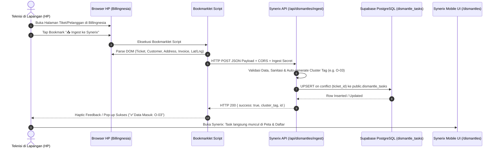

# PRODUCT REQUIREMENT DOCUMENT (PRD) & TECHNICAL SPECIFICATION
# Fitur: Smart Auto-Ingest Dismantle via Bookmarklet (Mobile-First)

* **Document Version:** 1.0.0 (Production-Ready)
* **Status:** Approved for Implementation
* **Repository:** `synerix-ftth` (Next.js 16 App Router, TypeScript, Tailwind CSS, Supabase PostgreSQL)
* **Author / Tech Lead:** Senior Fullstack & System Architect
* **Target Audience:** Engineering Team, DevOps, Field Operation Leads, QA Team

---

## 1. EXECUTIVE SUMMARY & PROBLEM STATEMENT

### 1.1 Latar Belakang & Masalah Operasional
Operasional penarikan perangkat (*dismantle*) pelanggan FTTH membutuhkan koordinasi cepat antara sistem penagihan (*Billingnesia*) dan tim lapangan (*Field Technicians / Maintenance Team*). Saat ini, alur kerja teknisi di lapangan sangat terfragmentasi dan memakan waktu:
1. Membuka tiket dismantle di browser HP pada aplikasi Billingnesia.
2. Menyalin ID Tiket dan ID Pelanggan secara manual.
3. Mencatat nama dan alamat lengkap pelanggan.
4. Membuka tab Invoice di Billingnesia, menghitung total tagihan tertunggak berstatus **JATUH TEMPO**.
5. Mengklik tautan Google Maps di Billingnesia, lalu menyalin angka koordinat latitude dan longitude.
6. Membuka Synerix FTTH, membuka form "Tambah Dismantle", lalu mem-paste data satu per satu.
7. Membuat label manual penamaan cluster/tanggal (misalnya `O-03` untuk 3 Oktober).

**Total waktu per tiket:** 3–5 menit dengan risiko kesalahan input (*human error*) mencapai 20–30% (terutama salah koordinat dan salah hitung tunggakan).

### 1.2 Solusi Teknikal (1-Tap Mobile Ingest)
Membangun pipeline automasi *zero-install* berbasis **Browser Bookmarklet JavaScript** yang berjalan langsung di browser HP teknisi (Google Chrome Android / Safari iOS) saat membuka halaman tiket Billingnesia:
* **Ekstraksi Otomatis:** Script memindai DOM halaman Billingnesia (ID Tiket, ID Pelanggan, Nama, Alamat, Total Tunggakan Invoice, dan Koordinat Google Maps).
* **Direct Sync:** Mengirim data terstruktur via HTTP POST ke endpoint backend Synerix (`/api/dismantles/ingest`).
* **Auto Clustering & Upsert:** Backend Synerix secara otomatis mengkalkulasi cluster tag tanggal (e.g. `O-03`), menetapkan default perangkat (`ONT, Dropcore`), dan melakukan `UPSERT` ke Supabase PostgreSQL tanpa menduplikasi data.
* **Hasil:** Alur 7 langkah dipangkas menjadi **1 kali tap** (< 2 detik), 100% akurat.

---

## 2. SYSTEM ARCHITECTURE & DATA FLOW



---

## 3. DATABASE SCHEMA & MIGRATION SPECIFICATION

> **PENTING (Koreksi terhadap draft awal):**  
> Tabel aktif di database Synerix adalah **`public.dismantle_tasks`** (bukan `dismantles`).  
> Kolom dan tipe data wajib disesuaikan dengan skema `dismantle_tasks` yang telah berjalan.

### 3.1 SQL Migration Script (`supabase/schema_dismantle_ingest.sql`)

```sql
-- ====================================================================
-- MIGRATION: Fitur Smart Auto-Ingest Dismantle via Bookmarklet
-- Target Table: public.dismantle_tasks
-- ====================================================================

-- 1. Tambah kolom pendukung ingest tiket & penagihan
ALTER TABLE public.dismantle_tasks 
ADD COLUMN IF NOT EXISTS ticket_id VARCHAR(100),
ADD COLUMN IF NOT EXISTS unpaid_amount NUMERIC(12, 2) DEFAULT 0,
ADD COLUMN IF NOT EXISTS billing_url TEXT,
ADD COLUMN IF NOT EXISTS auto_ingested BOOLEAN DEFAULT FALSE;

-- 2. Pastikan ticket_id bersifat UNIQUE untuk mendukung operasi UPSERT
DO $$ 
BEGIN
    IF NOT EXISTS (
        SELECT 1 FROM pg_constraint WHERE conname = 'uq_dismantle_tasks_ticket_id'
    ) THEN
        ALTER TABLE public.dismantle_tasks 
        ADD CONSTRAINT uq_dismantle_tasks_ticket_id UNIQUE (ticket_id);
    END IF;
END $$;

-- 3. Tambahkan Index untuk performa lookup tinggi
CREATE INDEX IF NOT EXISTS idx_dismantle_tasks_ticket_id 
ON public.dismantle_tasks(ticket_id);

CREATE INDEX IF NOT EXISTS idx_dismantle_tasks_auto_ingested 
ON public.dismantle_tasks(auto_ingested);

-- 4. Berikan komentar dokumentasi pada kolom
COMMENT ON COLUMN public.dismantle_tasks.ticket_id IS 'Nomor Tiket resmi dari Billingnesia (e.g. TKT202610014768)';
COMMENT ON COLUMN public.dismantle_tasks.unpaid_amount IS 'Total tagihan jatuh tempo yang belum terbayar (Rupiah)';
COMMENT ON COLUMN public.dismantle_tasks.billing_url IS 'URL langsung ke halaman tiket Billingnesia untuk referensi teknisi';
COMMENT ON COLUMN public.dismantle_tasks.auto_ingested IS 'Flag penanda bahwa data di-input otomatis via Bookmarklet HP';
```

### 3.2 TypeScript Interface Update (`src/lib/types/dismantle.ts`)

```typescript
export type DismantleStatus = 'QUEUE' | 'IN_PROGRESS' | 'COMPLETED' | 'FAILED';

export interface DismantleTask {
    id: string;
    ticket_id?: string | null;            // Nomor Tiket Billingnesia (e.g. TKT202610014768)
    customer_id: string;                  // ID Pelanggan (e.g. 0101010602040)
    customer_name: string;
    phone_number?: string | null;
    address: string;
    cluster_name: string;                 // Kode Cluster e.g. "O-03" atau nama cluster
    parent_odp_id?: string | null;
    parent_odp_name?: string | null;
    latitude: number;
    longitude: number;
    status: DismantleStatus;
    device_type: string;
    serial_number?: string | null;
    mac_address?: string | null;
    accessories?: string[] | null;
    evidence_photo_url?: string | null;
    failure_reason?: string | null;
    technician_name?: string | null;
    completed_at?: string | null;
    handover_status?: boolean;
    unpaid_amount?: number;               // Nominal tunggakan tagihan
    billing_url?: string | null;          // URL Billingnesia
    auto_ingested?: boolean;              // True jika via Bookmarklet
    created_at?: string;
    updated_at?: string;
    // Client-side computed
    distance_meters?: number;
}
```

---

## 4. BACKEND API SPECIFICATION: `/api/dismantles/ingest`

### 4.1 Endpoint Details
* **Route:** `/api/dismantles/ingest` (dengan alias/fallback `/api/dismantle/ingest`)
* **HTTP Method:** `POST` dan `OPTIONS` (Wajib untuk Preflight CORS).
* **Content-Type:** `application/json`

### 4.2 Handling CORS (Cross-Origin Resource Sharing)
Karena script bookmarklet dieksekusi di domain `billingnesia.com` (atau IP server billing) dan mengirim request ke `synerix-ftth.vercel.app`, browser akan melakukan pengecekan CORS:
* Wajib mengembalikan headers:
  ```http
  Access-Control-Allow-Origin: *
  Access-Control-Allow-Methods: POST, OPTIONS
  Access-Control-Allow-Headers: Content-Type, Authorization, x-synerix-ingest-secret
  ```

### 4.3 Ingest Secret Security
* Endpoint dapat diamankan menggunakan environment variable:
  `process.env.DISMANTLE_INGEST_SECRET` (fallback ke internal token jika belum diset).
* Bookmarklet menyertakan header `x-synerix-ingest-secret`.

### 4.4 Business Logic & Auto-Clustering
1. **Auto Cluster Tag Generator:**
   - Format: `[InisialBulan]-[TanggalDuaDigit]`
   - Contoh: 3 Oktober -> `O-03`, 15 November -> `N-15`, 7 Januari -> `J-07`.
   - Jika teknisi memasukkan parameter `cluster_name` eksplisit, gunakan itu. Jika tidak, gunakan auto cluster tag ini.
2. **Fallback Koordinat:**
   - Jika lat/lng tidak terdeteksi dari link Google Maps di halaman Billingnesia, gunakan koordinat pusat operasional default (misal `-7.5500, 110.8200`) dan tandai di catatan agar teknisi tahu koordinat perlu disesuaikan.
3. **Database UPSERT Strategy:**
   - Gunakan `supabase.from('dismantle_tasks').upsert(payload, { onConflict: 'ticket_id' })`.
   - Jika `ticket_id` sudah ada di database, update informasi tunggakan, alamat, dan link tanpa menghapus progres pekerjaan yang mungkin sudah berjalan (`status`, `technician_name`, dll).

### 4.5 Payload Schema (Request Body)
```json
{
  "ticket_id": "TKT202610014768",
  "customer_id": "0101010602040",
  "customer_name": "SRI RAHAYU",
  "phone_number": "081234567890",
  "address": "Jl. Melati No. 12, RT 02/03, Dukuhwaluh",
  "latitude": -7.424123,
  "longitude": 109.234123,
  "unpaid_amount": 111000,
  "billing_url": "https://billingnesia.example.com/tickets/TKT202610014768",
  "device_type": "ONT ZTE F609",
  "notes": "Dismantle Rutin"
}
```

### 4.6 Response Schema
* **Success (HTTP 200):**
  ```json
  {
    "success": true,
    "message": "Data dismantle berhasil disinkronisasi ke Synerix",
    "data": {
      "id": "c1f7b0a8-...",
      "ticket_id": "TKT202610014768",
      "customer_name": "SRI RAHAYU",
      "cluster_name": "O-03",
      "unpaid_amount": 111000,
      "status": "QUEUE"
    }
  }
  ```
* **Error (HTTP 400 / 500):**
  ```json
  {
    "success": false,
    "error": "Field customer_id atau ticket_id wajib diisi"
  }
  ```

---

## 5. MOBILE BOOKMARKLET SPECIFICATION & ROBUST SCRIPT

### 5.1 Karakteristik Teknis
* **Ukuran:** Ringkas (< 2 KB setelah minifikasi).
* **Kompatibilitas:** Google Chrome Mobile (Android), Safari Mobile (iOS), Firefox Mobile.
* **Tahan Eror (Resilient Parsing):** Menggunakan multiple selector fallback untuk mengantisipasi perubahan susunan HTML pada Billingnesia.

### 5.2 Source Code Bookmarklet (Unminified Reference)

```javascript
javascript:(function(){
  // 1. Konfigurasi Endpoint Synerix
  const API_URL = 'https://synerix-ftth.vercel.app/api/dismantles/ingest';
  const INGEST_SECRET = 'synerix-ftth-secret-2026';

  // 2. Feedback Visual Awal (Banner Indikator)
  const showToast = (msg, isError = false) => {
    const el = document.createElement('div');
    el.style.position = 'fixed';
    el.style.bottom = '20px';
    el.style.left = '50%';
    el.style.transform = 'translateX(-50%)';
    el.style.backgroundColor = isError ? '#EF4444' : '#0D9488';
    el.style.color = '#FFFFFF';
    el.style.padding = '12px 20px';
    el.style.borderRadius = '12px';
    el.style.boxShadow = '0 10px 25px rgba(0,0,0,0.3)';
    el.style.fontFamily = 'system-ui, sans-serif';
    el.style.fontSize = '13px';
    el.style.fontWeight = '600';
    el.style.zIndex = '999999';
    el.style.maxWidth = '90%';
    el.style.textAlign = 'center';
    el.innerText = msg;
    document.body.appendChild(el);
    setTimeout(() => el.remove(), 4000);
  };

  showToast('⏳ Mengekstrak data Billingnesia...');

  // 3. Objek Data Payload
  let payload = {
    ticket_id: '',
    customer_id: '',
    customer_name: '',
    phone_number: '',
    address: '',
    latitude: null,
    longitude: null,
    unpaid_amount: 0,
    billing_url: window.location.href,
    device_type: 'ONT ZTE F609',
    auto_ingested: true
  };

  // 4. Ekstraksi Ticket ID (URL atau Body)
  const ticketMatch = window.location.href.match(/TKT\d+/i) || document.body.innerText.match(/TKT\d+/i);
  if (ticketMatch) payload.ticket_id = ticketMatch[0].toUpperCase();

  // 5. Ekstraksi Customer ID (Pola angka 10-13 digit)
  const cidMatch = document.body.innerText.match(/\b\d{10,13}\b/);
  if (cidMatch) payload.customer_id = cidMatch[0];

  // 6. Ekstraksi Nama Pelanggan (Multiple Selector)
  const nameSelector = document.querySelector('h1, h2, h3, .card-title, .customer-name, [data-field="customer_name"]');
  if (nameSelector) {
    let raw = nameSelector.innerText;
    if (raw.includes('-')) raw = raw.split('-')[1];
    payload.customer_name = raw.replace(/Detail Pelanggan|Tiket/gi, '').trim();
  }

  // 7. Ekstraksi Nomor Telepon
  const phoneMatch = document.body.innerText.match(/\b(08\d{8,11}|628\d{8,11})\b/);
  if (phoneMatch) payload.phone_number = phoneMatch[0];

  // 8. Ekstraksi Alamat Lengkap
  const bodyText = document.body.innerText;
  const addrMatch = bodyText.match(/(jalan|jl\.|dusun|desa|kecamatan|kelurahan|komplek|perum)[\s\S]*?(?=\b(MARKETER|COMMITMENT|SERVER|KOMITMEN|PAKET|TAGIHAN|STATUS)\b|$)/i);
  if (addrMatch) {
    payload.address = addrMatch[0].replace(/\n+/g, ' ').replace(/\s{2,}/g, ' ').trim();
  }

  // 9. Ekstraksi Tagihan Tertunggak (Status JATUH TEMPO)
  let totalUnpaid = 0;
  const tableRows = Array.from(document.querySelectorAll('tr, .invoice-row, .card'));
  tableRows.forEach(row => {
    const text = row.innerText.toUpperCase();
    if (text.includes('JATUH TEMPO') || text.includes('UNPAID') || text.includes('BELUM BAYAR')) {
      const nominalMatch = row.innerText.match(/Rp\s*([\d.,]+)/i);
      if (nominalMatch) {
        const cleanNumber = parseInt(nominalMatch[1].replace(/[^0-9]/g, ''), 10);
        if (!isNaN(cleanNumber)) totalUnpaid += cleanNumber;
      }
    }
  });
  payload.unpaid_amount = totalUnpaid;

  // 10. Ekstraksi Koordinat Google Maps
  const mapLinks = Array.from(document.querySelectorAll('a[href*="google.com/maps"], a[href*="maps.google.com"], a[href*="maps.app.goo.gl"]'));
  for (let a of mapLinks) {
    const href = a.href;
    const match = href.match(/@(-?\d+\.\d+),(-?\d+\.\d+)/) || 
                  href.match(/q=(-?\d+\.\d+),(-?\d+\.\d+)/) ||
                  href.match(/query=(-?\d+\.\d+),(-?\d+\.\d+)/);
    if (match) {
      payload.latitude = parseFloat(match[1]);
      payload.longitude = parseFloat(match[2]);
      break;
    }
  }

  // Validasi Minimal
  if (!payload.ticket_id && !payload.customer_id) {
    showToast('❌ Gagal: Tidak menemukan Ticket ID atau Customer ID di halaman ini!', true);
    return;
  }

  // 11. Kirim Payload ke API Synerix
  fetch(API_URL, {
    method: 'POST',
    headers: {
      'Content-Type': 'application/json',
      'x-synerix-ingest-secret': INGEST_SECRET
    },
    body: JSON.stringify(payload)
  })
  .then(res => res.json())
  .then(res => {
    if (res.success) {
      if (navigator.vibrate) navigator.vibrate([100, 50, 100]); // Getar HP penanda sukses
      showToast('✅ Berhasil dikirim ke Synerix!\nCluster: ' + res.data.cluster_name + ' | Tagihan: Rp ' + Number(res.data.unpaid_amount).toLocaleString('id-ID'));
    } else {
      showToast('❌ Ingest Gagal: ' + (res.error || 'Server error'), true);
    }
  })
  .catch(err => {
    showToast('❌ Gagal terhubung ke Synerix: ' + err.message, true);
  });
})();
```

---

## 6. FRONTEND UI/UX ENHANCEMENTS (SYNERIX FTTH)

### 6.1 Peningkatan Komponen `DismantleCard.tsx` (Mobile Card View)
* **Header Kartu:**
  - Tambahkan badge cluster tag dengan highlight kontras (e.g. `O-03` dengan background Teal pekat).
  - Tampilkan `#TKT...` (Nomor Tiket Billingnesia) dengan ikon tiket kecil.
  - Tampilkan label `⚡ Auto-Ingest` jika `auto_ingested === true`.
* **Body Kartu:**
  - **Nominal Tagihan Tertunggak:** Tampilkan box penanda khusus jika `unpaid_amount > 0`:
    * Contoh: `⚠️ Tunggakan: Rp 111.000` (warna rose/amber yang mencolok agar teknisi tahu pelanggan memiliki piutang yang harus ditagih/diselesaikan).
* **Footer Kartu (Action Buttons):**
  - Tombol **"Buka Billing"** (tautan langsung membuka `billing_url` di tab baru).
  - Tombol **"Navigasi Maps"** (Google Maps & Waze navigation).
  - Tombol Update Status (`QUEUE` -> `IN_PROGRESS` -> `COMPLETED`).

### 6.2 Peningkatan Komponen `DismantleTable.tsx` (Desktop View)
* Kolom baru:
  - **Tiket / Ingest:** Menampilkan `ticket_id` dan badge `Auto`.
  - **Tunggakan:** Menampilkan `unpaid_amount` dengan formatting Rupiah (`Rp 111.000`).
  - **Aksi Cepat:** Icon external link menuju `billing_url`.

### 6.3 Fitur Baru: Modal Edukasi "Pasang Bookmarklet HP" (`InstallBookmarkletModal.tsx`)
* Tombol di Topbar / Header Halaman Dismantle: **"📱 Pasang Bookmarklet HP"**.
* Ketika diklik, modal menampilkan:
  1. Tombol **"Salin Kode Bookmarklet"** (1-click copy dengan toast konfirmasi).
  2. Panduan visual 3 langkah untuk **Google Chrome Android** (Bookmark URL replacement).
  3. Panduan visual 3 langkah untuk **Safari iOS**.
  4. Form uji coba (*sandbox tester*) untuk memvalidasi apakah koneksi API dari browser berhasil.

---

## 7. RISK ASSESSMENT & MITIGATION STRATEGY

| Potensi Risiko | Tingkat | Dampak | Solusi Mitigasi |
| :--- | :---: | :---: | :--- |
| **CORS Blocked di Browser HP** | Tinggi | Bookmarklet gagal fetch ke Synerix | Endpoint wajib mengimplementasikan CORS headers lengkap (`Access-Control-Allow-Origin: *`, `Access-Control-Allow-Methods: POST, OPTIONS`). |
| **Perubahan Struktur DOM Billingnesia** | Sedang | Data alamat/nama tidak ter-parse sempurna | Menggunakan multi-pattern regex dan fallback selector. Jika parsing parsial, simpan data yang berhasil dan beri flag review. |
| **Duplikasi Tiket saat Tap Berkali-kali** | Rendah | Data ganda mengotori daftar dismantle | Gunakan PostgreSQL `UNIQUE(ticket_id)` dan query `UPSERT`. Klik ganda hanya akan mengupdate row yang sama. |
| **Pelanggan Tidak Memiliki Pin Google Maps** | Sedang | Titik tidak muncul di peta Synerix | Tetapkan koordinat default area operasional dan tandai badge "Perlu Update Lokasi". |

---

## 8. STEP-BY-STEP IMPLEMENTATION & ROLLOUT PLAN

### Tahap 1: Backend & Database (Hari Ke-1)
1. Eksekusi migration SQL pada Supabase SQL Editor (`ticket_id`, `unpaid_amount`, `billing_url`, `auto_ingested`).
2. Update TypeScript definition di `src/lib/types/dismantle.ts`.
3. Buat API Route di `src/app/api/dismantles/ingest/route.ts` lengkap dengan penanganan CORS Preflight, validasi schema, auto-clustering (`O-DD`), dan Supabase Upsert.
4. Buat rewrite atau secondary route di `src/app/api/dismantle/ingest/route.ts` agar kompatibel dengan kedua variasi URL singular & plural.

### Tahap 2: Frontend UI & Integrasi (Hari Ke-2)
1. Perbarui `src/components/dismantles/DismantleCard.tsx`:
   - Tambahkan display `unpaid_amount` (Rupiah).
   - Tambahkan link tombol ke `billing_url`.
   - Tampilkan badge `ticket_id` dan `auto_ingested`.
2. Perbarui `src/components/dismantles/DismantleTable.tsx` untuk menampilkan kolom tagihan & tiket.
3. Buat komponen `InstallBookmarkletModal.tsx` dan pasang di `src/app/dismantles/page.tsx` agar teknisi dapat menyalin script kapan saja.

### Tahap 3: Uji Coba, Validasi & Deploy (Hari Ke-3)
1. Pengujian lokal menggunakan `curl` dan script bookmarklet simulasi.
2. Commit dan push ke branch `main` GitHub untuk trigger otomatis CI/CD Vercel.
3. Pengujian lapangan nyata: Uji coba instalasi bookmarklet di HP Android dan iOS pada halaman Billingnesia asli.
4. Verifikasi bahwa data tersimpan di Supabase dan langsung tampil di Peta GIS Synerix.

---

*Dokumen ini merupakan spesifikasi resmi yang siap dieksekusi secara bertahap tanpa mengganggu modul yang sedang berjalan.*
